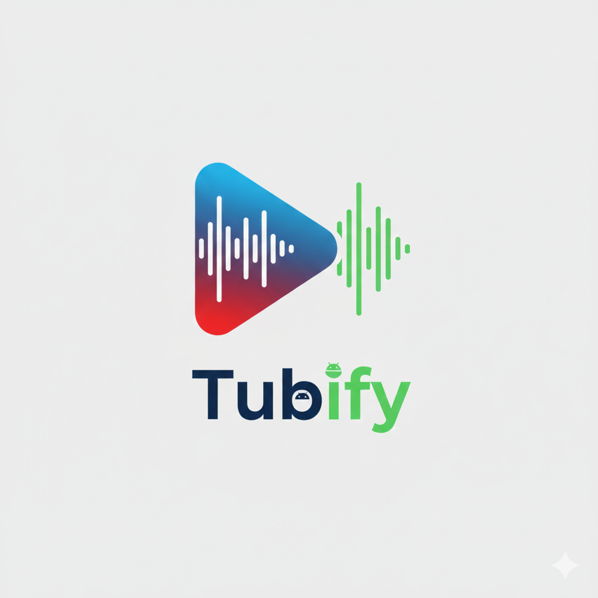

<p align="center">
  
</p>

# Tubify 📺

Tubify is a lightweight, open-source Android utility designed for seamless YouTube background playback and library management. No more stopping your music when you switch apps.

## ✨ Features

- **Background Playback**: Keep listening to your favorite videos/playlists even when the screen is off or you're using other apps.
- **Easy Sharing**: Share any YouTube link from the official app directly to Tubify to save it instantly.
- **Local Library**: Organize your shared videos and playlists in one place.
- **Quick Search**: Swiftly find content in your saved library with real-time filtering.
- **Google Sign-In**: Sync your personal YouTube playlists directly into the app.
- **Ads Skip**: No more annoying ads. Enjoy an uninterrupted viewing experience.

## � Download

You can download the latest APK from the [Releases](https://github.com/mhdanwar/Tubify/releases) page.

## 🏗️ Build Yourself

To run Tubify locally, you'll need to set up a YouTube Data API v3 key.

1.  Go to the [Google Cloud Console](https://console.cloud.google.com/).
2.  Create a new project and enable the **YouTube Data API v3**.
3.  Create an **API Key**.
4.  Add the key to your `local.properties` file:
    ```properties
    YOUTUBE_API_KEY=your_api_key_here
    ```
5.  Open the project in Android Studio and build!

## 🛠 Tech Stack

- **UI**: Jetpack Compose
- **Language**: Kotlin
- **Database**: Room
- **Networking**: Ktor
- **Player**: [android-youtube-player](https://github.com/PierfrancescoSoffritti/android-youtube-player)

## 📝 Todo

- [ ] Google Sign in
- [ ] Picture in Picture

## 📜 License

Distributed under the MIT License. See `LICENSE` for more information.
